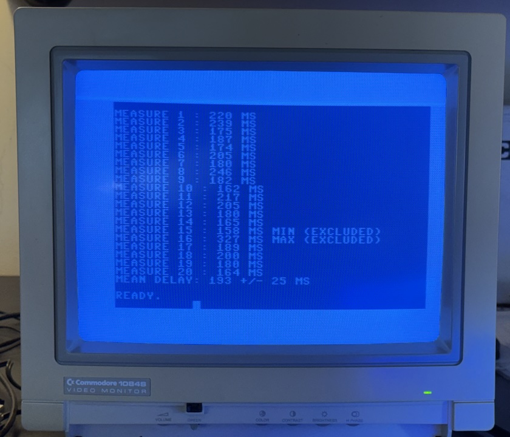
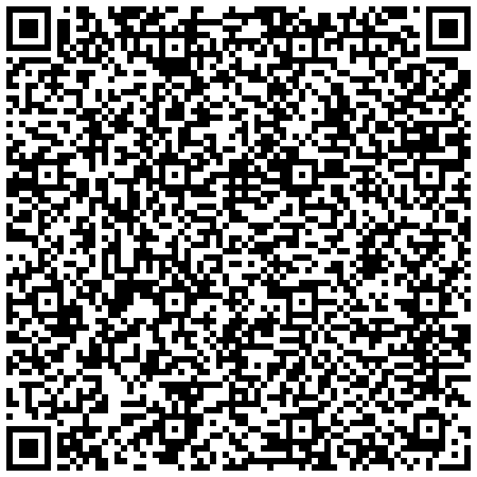

# C64 testdelay



This is a simple implementation in C64 BASIC + a machine language routine of an idea I had some years ago, when the C64 Mini was released and I had just bought an original C64 breadbin on eBay (my original machine from 1982–1985 had been swapped for a C128D).

At the time, most tests I saw on YouTube were done using LCD monitors, and I suspected that reaction times in fast-paced games were being affected by LCD display latency.

So I created a program to measure reaction times across different setups. The tester (myself) and his admittedly limited and aging reflexes remained constant, while the hardware changed:

* C64 via VICE emulator on a Mac
* Original C64 hardware on an LCD monitor
* Original C64 hardware on a CRT (Commodore 1084S)

I lost my original measurements, but now that my Commodore 64 Ultimate (Starlight Edition :D) has arrived from the now-resurrected Commodore (we will be forever in debt, Perifractic!), I decided to revisit this 5-year-old piece of code and clean it up for a proper release into the wild world of data-obsessed nerd testers (like myself).

A machine language routine handles the timing, measuring delay in milliseconds using the CPU clock (both PAL and NTSC are supported). I don’t remember all the details of this routine (the file is dated 2019), and it’s not entirely mine: I recall adapting it slightly from existing code. Apologies to the original author—once I identify the source, proper credit will be added here.

⸻

How it works

Load the BASIC program and run it.

[Watch a sample video](https://www.youtube.com/watch?v=q4px_UbehjI)


You will see a blank screen with a counter (1 to 20) in the top-left corner, representing each measurement.

After a random pause (*), a brief raster effect appears at the top of the screen. As soon as you see it, press the space bar (or joystick fire in port 2).

(*) pressing (or keeping pressed) the spacebar before the graphic effect will reset the random pause.

At the end of the 20 measurements:

* the highest and lowest values are discarded
* the mean and standard deviation are computed on the remaining 18 samples

The final result is shown as:

Measured delay: 250 +/- 30 ms

⸻

Sample results

* C64 (VICE emulator on Mac): 255 ± 20 ms
* C64 Ultimate on LCD: 235 ± 19 ms
* C64 Ultimate on CRT (Commodore 1084S): 193 ± 25 ms
* Original C64 on CRT (Commodore 1084S): 192 ± 16 ms

Note: absolute values depend on the person (age, reflexes, gaming experience, etc.). What matters is the difference between setups.

In this case:

* Original C64 and C64 Ultimate are indistinguishable (within error)
* LCD introduces ~40–50 ms delay (about 1–2 frames)

⸻

Notes

This project contains:

* the BASIC listing (which also writes the ML routine into memory)
* a d64 disk image file with the program 
* a disassembly of the machine language routine (withing this readme, see below)

# Please send your best score + hardware setup \^_^/
(see the bug/issue I opened)

# Tips / buy me a coffee ^_^
**Bolt12 LN** 

lno1zrxq8pjw7qjlm68mtp7e3yvxee4y5xrgjhhyf2fxhlphpckrvevh50u0q29vqjjqgyu80agddjw9xwup56yka8t9hzq8audxmks66zepgqga7qsr9jmvaqlf7efa89v8tjvn5tcsfvxmz5cspdjglqv93lw97e8je6dsqvljglw2m5jg0tsmxwjj2mwgp7aprm5k5xuttf5pwxghh0qtrx28g8lqmq7yd28ysp9k7x4x5j4r8wqaa6sjqwwx3m68mszkfruas09hwpm23t4yr9pevaqa8022ps705p9jtndawqqsp8h4gukup8ejnsz7fcwr6tn8y5




⸻

# Machine Language routine
(already loaded in memory by the BASIC program)

```asm
2000  A9 7F       LDA #$7F
2002  8D 0D DD    STA $DD0D
2005  A9 D9       LDA #$D9
2007  AE A6 02    LDX $02A6
200a  E0 01       CPX #$01
200c  F0 02       BEQ $2010
200e  A9 FE       LDA #$FE
2010  8D 04 DD    STA $DD04
2013  A9 03       LDA #$03
2015  8D 05 DD    STA $DD05
2018  A9 FF       LDA #$FF
201a  8D 06 DD    STA $DD06
201d  8D 07 DD    STA $DD07
2020  A9 51       LDA #$51
2022  8D 0F DD    STA $DD0F
2025  60          RTS
2026  60          RTS
2027  78          SEI
2028  AD 21 D0    LDA $D021
202b  8D FD 20    STA $20FD
202e  A9 01       LDA #$01
2030  8D 19 D0    STA $D019
2033  A9 32       LDA #$32
2035  8D 12 D0    STA $D012
2038  AD 11 D0    LDA $D011
203b  29 7F       AND #$7F
203d  8D 11 D0    STA $D011
2040  AD 19 D0    LDA $D019
2043  29 01       AND #$01
2045  F0 F9       BEQ $2040
2047  A9 11       LDA #$11
2049  8D 0E DD    STA $DD0E
204c  AD 12 D0    LDA $D012
204f  C9 32       CMP #$32
2051  90 0A       BCC $205D
2053  C9 42       CMP #$42
2055  B0 06       BCS $205D
2057  EE 21 D0    INC $D021
205a  4C 63 20    JMP $2063
205d  AD FD 20    LDA $20FD
2060  8D 21 D0    STA $D021
2063  AD 01 DC    LDA $DC01
2066  C9 EF       CMP #$EF
2068  D0 E2       BNE $204C
206a  A9 00       LDA #$00
206c  8D 0E DD    STA $DD0E
206f  AD 06 DD    LDA $DD06
2072  49 FF       EOR #$FF
2074  8D FE 20    STA $20FE
2077  AD 07 DD    LDA $DD07
207a  49 FF       EOR #$FF
207c  8D FF 20    STA $20FF
207f  AD FD 20    LDA $20FD
2082  8D 21 D0    STA $D021
2085  58          CLI
2086  B8          CLV
2087  50 8F       BVC $2018
2089  00          BRK
208a  00          BRK
208b  00          BRK
208c  00          BRK
208d  00          BRK
208e  00          BRK
208f  00          BRK
...
```
